<div align="center">

# Universo Profesional

### Your career now has a memory. And an agent of its own.

A bi-temporal knowledge graph of one professional life — fed by conversation, MCP and syncs;
exploited as job-tailored CVs and a twin that answers recruiters when you're not there.


[](https://github.com/Jorge-Medina-Diaz/universo-profesional/actions/workflows/ci.yml)

[Feed it](#layer-1--feeding-it-costs-one-conversation) ·
[Exploit it](#layer-2--what-the-memory-does-for-you) ·
[How retrieval works](#anatomy-of-an-answer) ·
[Honest status](#honest-status)

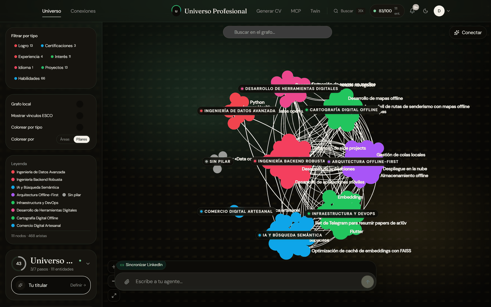

</div>

---

## Every two years, I rebuilt my CV from scratch

> Your CV died the day you exported it.
> Everything you've done since lives nowhere.
> Give your career a memory system.
> One that asks, remembers, and works while you don't.

I build a lot. Side projects, experiments, technologies I try for a month and quietly absorb.
Then every couple of years a job search starts and I spend a weekend doing archaeology on my
own life — old repos, old Slack, trying to remember what that migration actually improved.

The problem was never *writing* the CV. It's that **the source of truth never existed**. So I
built the source of truth, and made feeding it cost as close to nothing as I could get.

## What it is

A personal knowledge graph that models a career as what it actually is — entities and typed,
time-stamped relationships — wrapped in an agent that maintains it by talking to you. Two layers:

- **Layer 1 — feeding it.** Many decoupled ingestion paths, all cheap, so the profile stays
  current instead of getting panic-rewritten every two years.
- **Layer 2 — exploiting it.** ATS-tailored CVs per job ad, and a twin recruiters can *talk to*
  instead of reading a PDF.

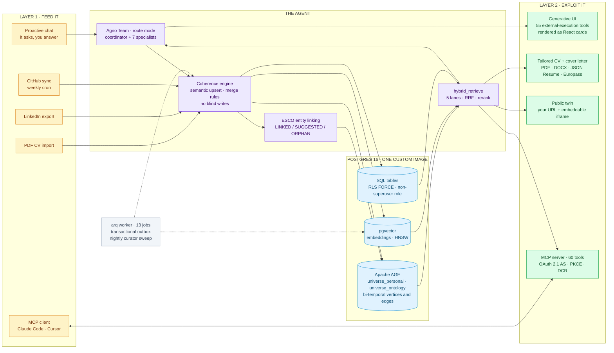
```mermaid
flowchart LR
    subgraph FEED["LAYER 1 · FEED IT"]
        direction TB
        CHAT["Proactive chat<br/>it asks, you answer"]
        MCPIN["MCP client<br/>Claude Code · Cursor"]
        PDFIN["PDF CV import"]
        LIIN["LinkedIn export"]
        GHIN["GitHub sync<br/>weekly cron"]
    end

    subgraph BRAIN["THE AGENT"]
        direction TB
        TEAM["Agno Team · route mode<br/>coordinator + 7 specialists"]
        COH["Coherence engine<br/>semantic upsert · merge rules<br/>no blind writes"]
        ESCO["ESCO entity linking<br/>LINKED / SUGGESTED / ORPHAN"]
        RET["hybrid_retrieve<br/>5 lanes · RRF · rerank"]
    end

    subgraph STORE["POSTGRES 16 · ONE CUSTOM IMAGE"]
        direction TB
        AGE[("Apache AGE<br/>universe_personal · universe_ontology<br/>bi-temporal vertices and edges")]
        VEC[("pgvector<br/>embeddings · HNSW")]
        SQL[("SQL tables<br/>RLS FORCE · non-superuser role")]
    end

    subgraph OUT["LAYER 2 · EXPLOIT IT"]
        direction TB
        GENUI["Generative UI<br/>55 external-execution tools<br/>rendered as React cards"]
        DOCS["Tailored CV + cover letter<br/>PDF · DOCX · JSON Resume · Europass"]
        TWIN["Public twin<br/>your URL + embeddable iframe"]
        MCPS["MCP server · 60 tools<br/>OAuth 2.1 AS · PKCE · DCR"]
    end

    WORKER["arq worker · 13 jobs<br/>transactional outbox<br/>nightly curator sweep"]

    CHAT --> TEAM
    PDFIN --> COH
    LIIN --> COH
    GHIN --> COH
    MCPIN <--> MCPS

    TEAM --> COH
    COH --> ESCO
    COH --> SQL
    ESCO --> AGE
    COH --> AGE
    COH --> VEC

    AGE --> RET
    VEC --> RET
    SQL --> RET
    RET --> TEAM

    TEAM --> GENUI
    RET --> DOCS
    RET --> TWIN
    RET --> MCPS

    WORKER -.-> COH
    WORKER -.-> VEC

    classDef feed fill:#fef3c7,stroke:#d97706,color:#78350f
    classDef brain fill:#ede9fe,stroke:#7c3aed,color:#3b0764
    classDef store fill:#e0f2fe,stroke:#0284c7,color:#0c4a6e
    classDef out fill:#dcfce7,stroke:#16a34a,color:#14532d
    classDef bg fill:#f1f5f9,stroke:#94a3b8,color:#334155

    class CHAT,MCPIN,PDFIN,LIIN,GHIN feed
    class TEAM,COH,ESCO,RET brain
    class AGE,VEC,SQL store
    class GENUI,DOCS,TWIN,MCPS out
    class WORKER bg
```

---

## Layer 1 — Feeding it costs one conversation

You start — with a sentence, a link or a CV. The agent reacts, offers to investigate what you
bring, and pulls the thread with open questions so you keep talking.

| Path | You do | It does |
|---|---|---|
| **Proactive chat** | "I got the Terraform Associate cert in March" | Routes to `entity_curator`, proposes a card you confirm |
| **MCP** | `claude mcp add --transport http …` | 60 tools inside Claude Code / Cursor, OAuth 2.1 |
| **PDF CV import** | Drop your old CV | Parses it, returns every entry for review |
| **LinkedIn** | Upload the export ZIP | Batch import review card |
| **GitHub** | Connect once | Weekly cron resync |

MCP is the only path that runs both directions — write from your editor, and ask what you did.

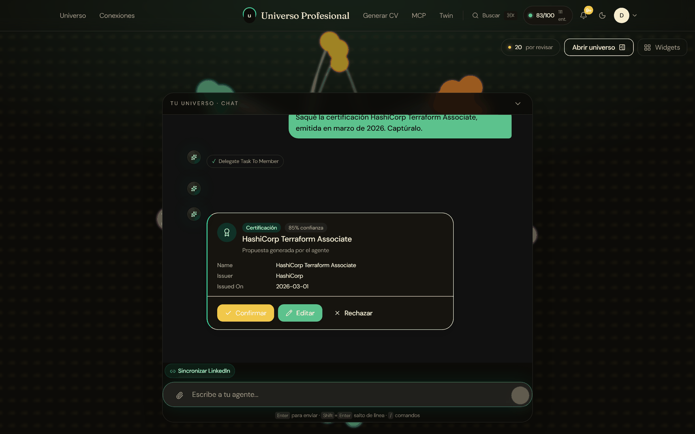

*The product UI is Spanish (es/en via i18next); screenshots are Spanish.*

**Nothing is written blindly.** Every write goes through a coherence engine — a semantic upsert
with declarative merge rules. Say "Python" today and "5 years of Python" in six months and it
merges instead of duplicating. Skills are then linked against **ESCO**, the EU occupation
ontology, in three states: `LINKED` above 0.86, `SUGGESTED` above 0.70 (which becomes a
disambiguation card, not a guess), `ORPHAN` otherwise — falling back to a small curated ontology
for AI-era skills ESCO simply doesn't have yet, like MCP or RAG.

**Your memory follows you into Claude, ChatGPT or Cursor.**

```bash
claude mcp add --transport http universo https://your-host/mcp
```

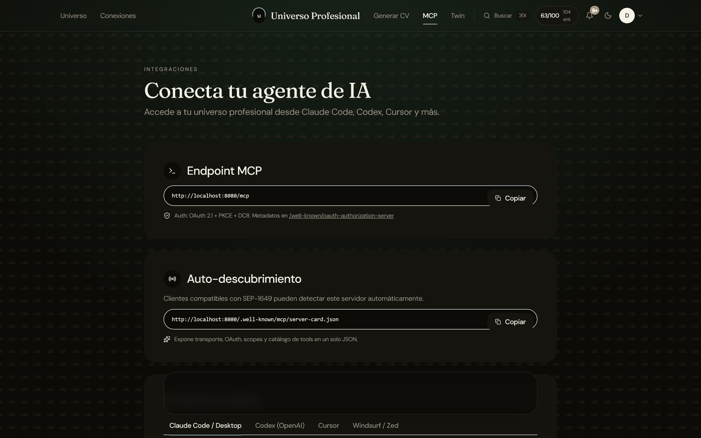

---

## Layer 2 — What the memory does for you

Once your history lives in one place, everything else takes minutes.

**A CV per job ad, with proof.** Paste the ad, get an ATS-ready CV built only from your facts,
grounded in the corpus — `no evidence — we won't invent it`. Exports to PDF, DOCX, JSON Resume
and Europass, across 4 templates, with public share links.

**The twin — the disruptive one.** *The first professional profile you can talk to.* Recruiters
chat with your knowledge base at `/#/t/{slug}`, or embedded in your own portfolio with
`?embed=1`. It runs a closure-scoped, tool-limited agent with no team, no DB handle and no BYOK;
its identity comes from resolving the slug, so nothing about *whose* profile it is can be spoofed
from the request. Visitors can leave their contact details.

> Curation is enforced at the **retrieval layer** — a kinds filter inside the query, not an
> instruction in the prompt. You can't jailbreak a `WHERE` clause.

| The public twin | Embedded in your portfolio |
|---|---|
| 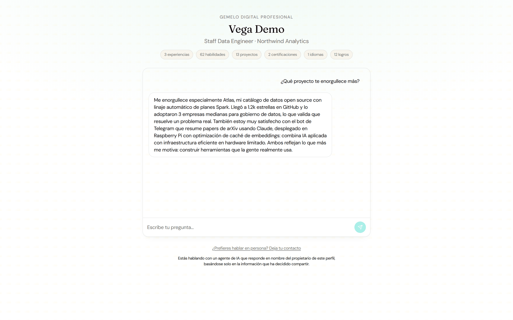 | 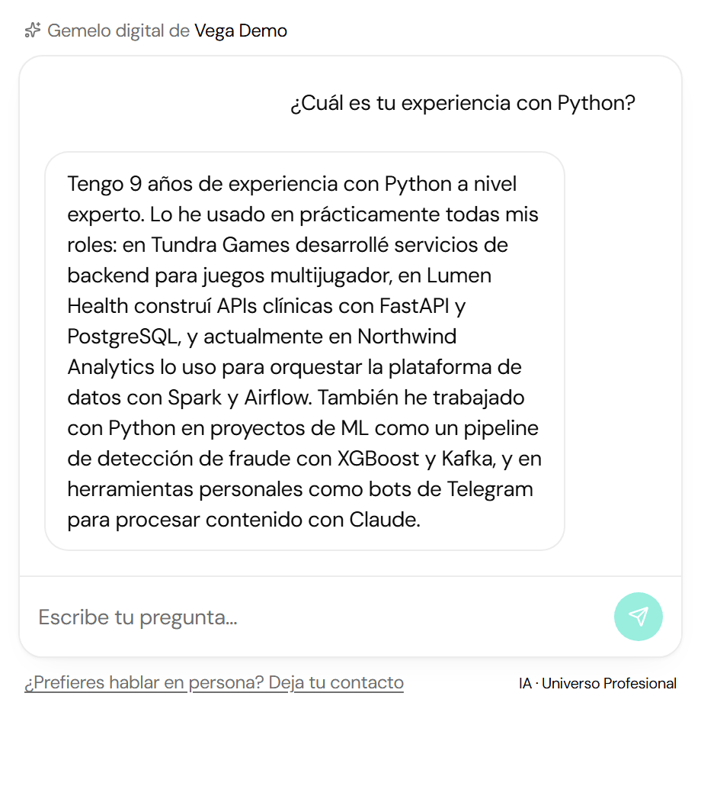 |

Plus an applications tracker with per-requirement match scoring, and interview prep built from
your own stories.

| Tailored CV generation | Applications pipeline |
|---|---|
| 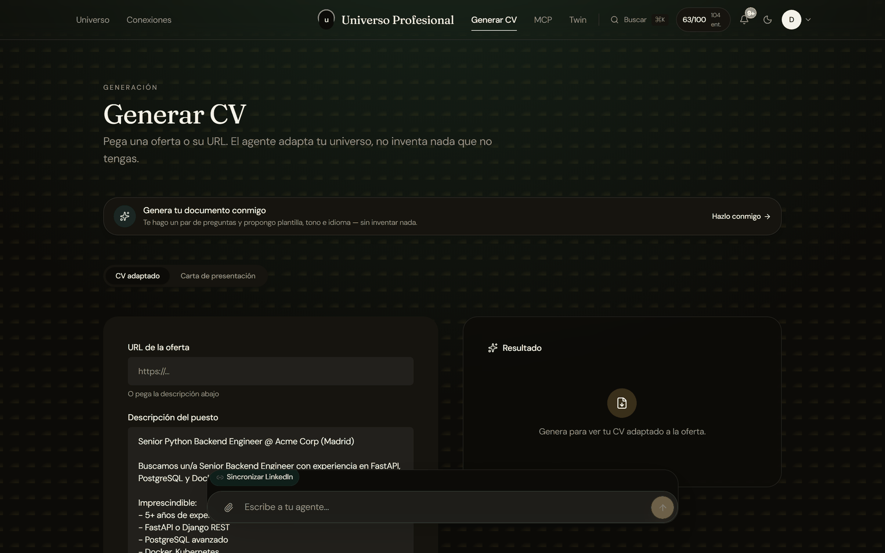 | 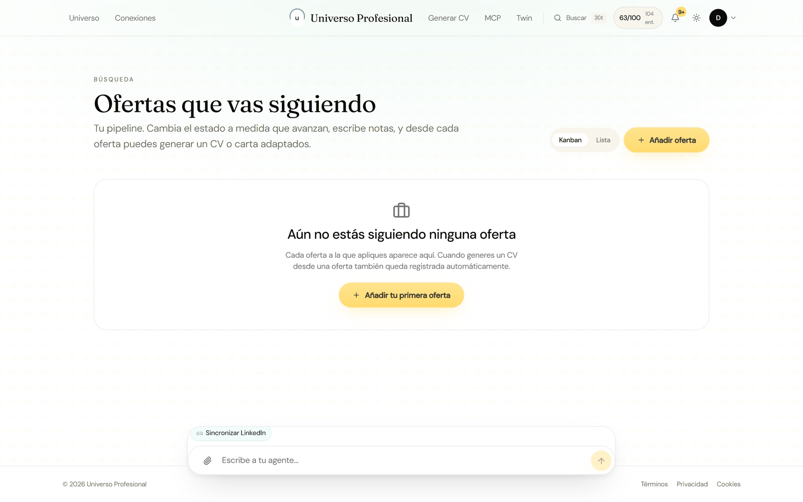 |

---

## The hinge — the agent doesn't reply, it builds the UI

This is the mechanism both layers run on.

- **55 tools declared `external_execution=True`.** Their Python bodies never run. Agno emits an
  AG-UI tool-call event, React renders it as a card via CopilotKit's `renderAndWaitForResponse`,
  and the user's decision comes back as the tool result. The signature exists purely to give the
  model a typed contract.
- **The agent can pilot the graph.** `control_graph` and `animate_graph` drive `flyTo`, `pulse`,
  `highlightSet` and `reset` on the live constellation — cards carry a "reveal it in the graph"
  button that animates the real thing.
- **No tool is ever silent.** A wildcard `"*"` action renders a generic card for anything the
  frontend doesn't know yet.

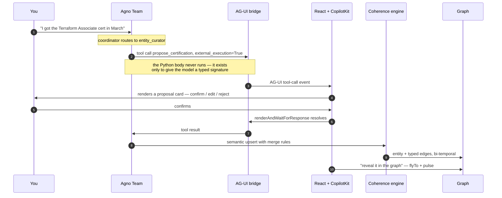
```mermaid
sequenceDiagram
    autonumber
    participant U as You
    participant T as Agno Team
    participant B as AG-UI bridge
    participant R as React + CopilotKit
    participant C as Coherence engine
    participant G as Graph

    U->>T: "I got the Terraform Associate cert in March"
    Note over T: coordinator routes to entity_curator
    T->>B: tool call propose_certification, external_execution=True
    Note over T,B: the Python body never runs — it exists<br/>only to give the model a typed signature
    B->>R: AG-UI tool-call event
    R->>U: renders a proposal card — confirm / edit / reject
    U->>R: confirms
    R->>B: renderAndWaitForResponse resolves
    B->>T: tool result
    T->>C: semantic upsert with merge rules
    C->>G: entity + typed edges, bi-temporal
    R->>G: "reveal it in the graph" — flyTo + pulse
```

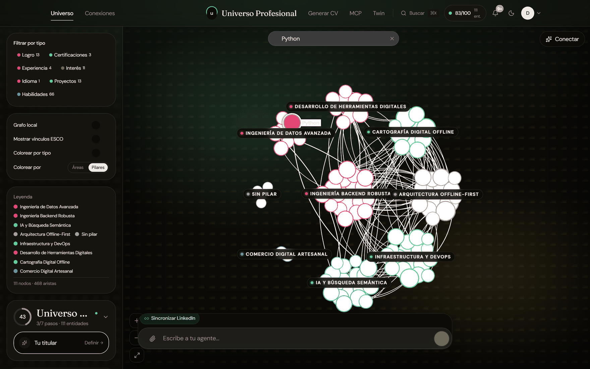

---

## Anatomy of an answer

What happens in the second between a question and an evidence-backed answer.

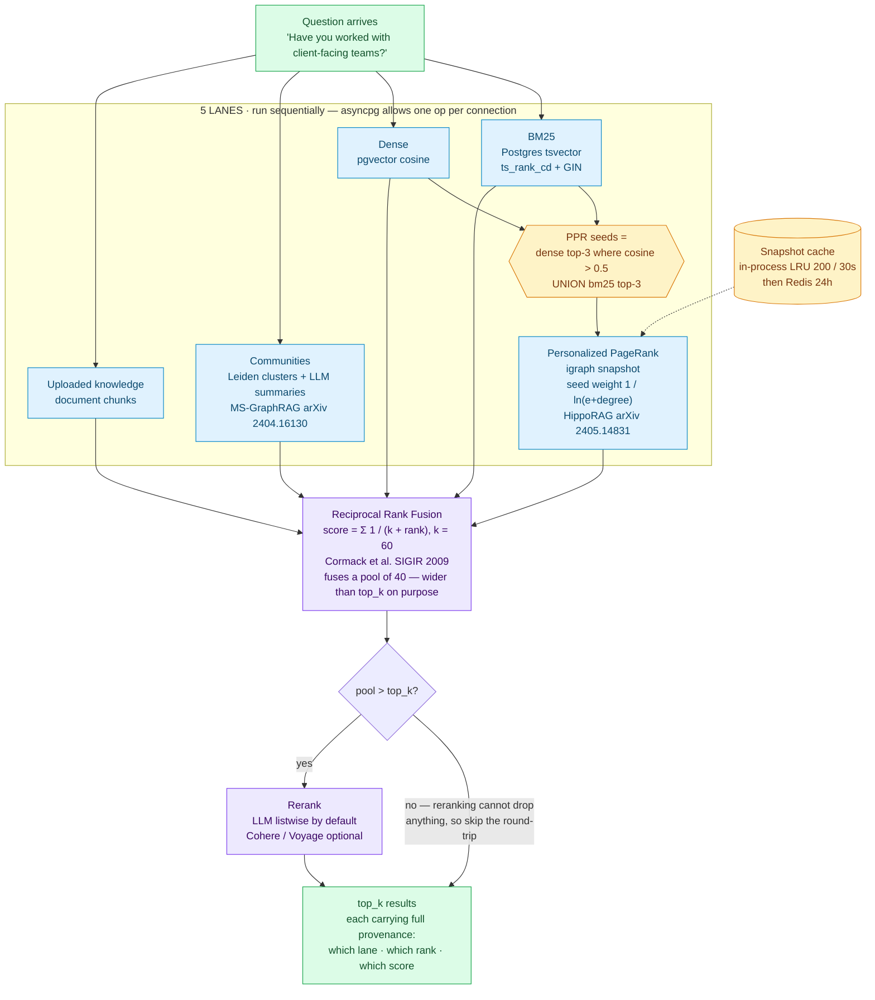
```mermaid
flowchart TB
    Q["Question arrives<br/>'Have you worked with client-facing teams?'"]

    subgraph LANES["5 LANES · run sequentially — asyncpg allows one op per connection"]
        BM25["BM25<br/>Postgres tsvector<br/>ts_rank_cd + GIN"]
        DENSE["Dense<br/>pgvector cosine"]
        SEEDS{{"PPR seeds =<br/>dense top-3 where cosine > 0.5<br/>UNION bm25 top-3"}}
        PPR["Personalized PageRank<br/>igraph snapshot<br/>seed weight 1 / ln(e+degree)<br/>HippoRAG arXiv 2405.14831"]
        COMM["Communities<br/>Leiden clusters + LLM summaries<br/>MS-GraphRAG arXiv 2404.16130"]
        KNOW["Uploaded knowledge<br/>document chunks"]
    end

    Q --> BM25
    Q --> DENSE
    Q --> COMM
    Q --> KNOW

    DENSE --> SEEDS
    BM25 --> SEEDS
    SEEDS --> PPR

    BM25 --> RRF
    DENSE --> RRF
    PPR --> RRF
    COMM --> RRF
    KNOW --> RRF

    RRF["Reciprocal Rank Fusion<br/>score = Σ 1 / (k + rank), k = 60<br/>Cormack et al. SIGIR 2009<br/>fuses a pool of 40 — wider than top_k on purpose"]

    RRF --> GATE{"pool > top_k?"}
    GATE -- "no — reranking cannot drop<br/>anything, so skip the round-trip" --> OUT
    GATE -- "yes" --> RERANK["Rerank<br/>LLM listwise by default<br/>Cohere / Voyage optional"]
    RERANK --> OUT

    OUT["top_k results<br/>each carrying full provenance:<br/>which lane · which rank · which score"]

    SNAP[("Snapshot cache<br/>in-process LRU 200 / 30s<br/>then Redis 24h")]
    SNAP -.-> PPR

    classDef lane fill:#e0f2fe,stroke:#0284c7,color:#0c4a6e
    classDef fuse fill:#ede9fe,stroke:#7c3aed,color:#3b0764
    classDef term fill:#dcfce7,stroke:#16a34a,color:#14532d
    classDef seed fill:#fef3c7,stroke:#d97706,color:#78350f

    class BM25,DENSE,PPR,COMM,KNOW lane
    class RRF,RERANK fuse
    class Q,OUT term
    class SEEDS,SNAP seed
```

| Lane | Catches | How |
|---|---|---|
| **BM25** | Exact names, acronyms, tools | Postgres `tsvector` + `ts_rank_cd`, GIN index |
| **Dense** | Paraphrase, meaning | pgvector cosine |
| **Personalized PageRank** | Things *connected* to the hit | igraph snapshot, HippoRAG inverse-degree seed weight `1/ln(e+degree)` ([2405.14831](https://arxiv.org/abs/2405.14831)) |
| **Communities** | Themes across the whole graph | Leiden clusters, LLM-named, MS-GraphRAG local→global ([2404.16130](https://arxiv.org/abs/2404.16130)) |
| **Knowledge** | Uploaded PDFs and papers | Chunk embeddings |

The decisions that matter more than the lane list:

- **PPR seeds are `dense ∪ BM25`, not dense alone.** Dense goes dark on acronyms and proper
  nouns, so seeding only from it would silently stop the structural lane firing *exactly* when
  keyword search was the thing that worked.
- **RRF fuses a wider pool (40) than `top_k`** so the reranker has candidates it can actually
  *drop*, rather than just reordering what was already going to be returned.
- **The reranker is gated on pool size.** It's an LLM round-trip inside the agent's turn; when
  the pool can't shrink, it can't earn its latency.
- **Every result carries its provenance** — which lane found it, at what rank, with what score.

`BM25 + embeddings + personalized PageRank + communities · RRF fusion · per-user isolation (RLS)`

---

## Under the hood

| | |
|---|---|
| **Backend** | 361 Python files · ~51k LOC · 15 bounded contexts · 42 migrations |
| **Frontend** | 237 TS/TSX files · ~40k LOC · zero-dependency hash router |
| **Agents** | 1 coordinator Team in route mode + 7 specialists · Sonnet routes, Haiku executes |
| **Generative UI** | 55 external-execution tools · ~25 cards · 13 summonable widgets |
| **Graph** | 2 AGE graphs · 18 vertex labels · 13 edge types · bi-temporal on every vertex *and* edge |
| **Retrieval** | 5 lanes · RRF k=60 · pool 40 → top_k |
| **MCP** | 60 tools · 20 OAuth scopes · spec 2025-11-25 |
| **Background** | 13 arq jobs · nightly curator sweep · transactional outbox |
| **Tests** | 104 test files · 855 test functions across unit / integration / e2e |
| **CI** | ruff (16 rule families incl. bandit) · mypy strict · import-linter · pytest · vitest · Playwright · Trivy fs + image — see [Honest status](#honest-status) |

**The hard parts**

- **RLS that survives mid-session commits.** `SET LOCAL` dies at commit, so any flow that
  committed mid-request silently lost its tenant scope — reads saw nothing, writes tripped
  `WITH CHECK`. A SQLAlchemy `after_begin` listener re-arms the GUCs on every new transaction,
  killing the bug class; a catalog-driven migration then rewrote every policy to one canonical
  clause. Write-up: [SECURITY_RLS_STATUS.md](docs/SECURITY_RLS_STATUS.md).
- **A transaction that lied about committing.** Community detection failed on a permission error,
  which left the Postgres transaction aborted; Postgres then turned the caller's `COMMIT` into a
  silent `ROLLBACK`, discarding hundreds of inferred edges while the endpoint still returned
  `{"status": "ok"}`. It now runs inside a savepoint. A `try/except` around DB work is not
  error handling.
- **A graph engine that dropped writes without erroring.** Apache AGE 1.5 silently discards a
  `SET` that follows a `MERGE` which *creates* a relationship — the edge lands with
  `properties: {}`. Node `MERGE` is unaffected, so vertices always looked right and this hid
  behind them. Every edge was therefore born with no `source`, `confidence` or `valid_from`,
  making it invisible to the maintenance passes that filter on those — the bi-temporal model was
  decorative for any edge that had only been written once. Fixed by splitting the statement, with
  an integration test that runs against real AGE, because no mock can reproduce an engine quirk.
- **Transactional outbox for embeddings.** `FOR UPDATE SKIP LOCKED`, first-run fast-forward,
  contiguous-only cursor advance, and an `ingestion_to_queryable_seconds` SLO histogram.
- **A self-hosted OAuth 2.1 Authorization Server.** PKCE + Dynamic Client Registration,
  RFC 8414 / 9728 / 8707 / 7591, 20 scopes — so any MCP client connects with one command.
- **Postgres 16 with pgvector *and* Apache AGE compiled into one image**, so dev, CI and prod run
  the same build and no AGE-dependent path goes untested.
- **Architecture enforced by CI, not by review.** import-linter holds a 4-layer contract
  (`interfaces → infrastructure → application → domain`) across 13 containers; a cross-layer
  import fails the build.
- **Chat TTFT p50: 6.63s → 3.11s.** Prompt-cached static coordinator instructions, 26 specialists
  consolidated to 7, unused tool schemas dropped from the coordinator.
  Method and numbers: [LATENCY_BASELINE.md](docs/OPERATIONS/LATENCY_BASELINE.md).

<details>
<summary><b>More screenshots</b> — landing, home, activity, connections, twin settings</summary>

| | |
|---|---|
| 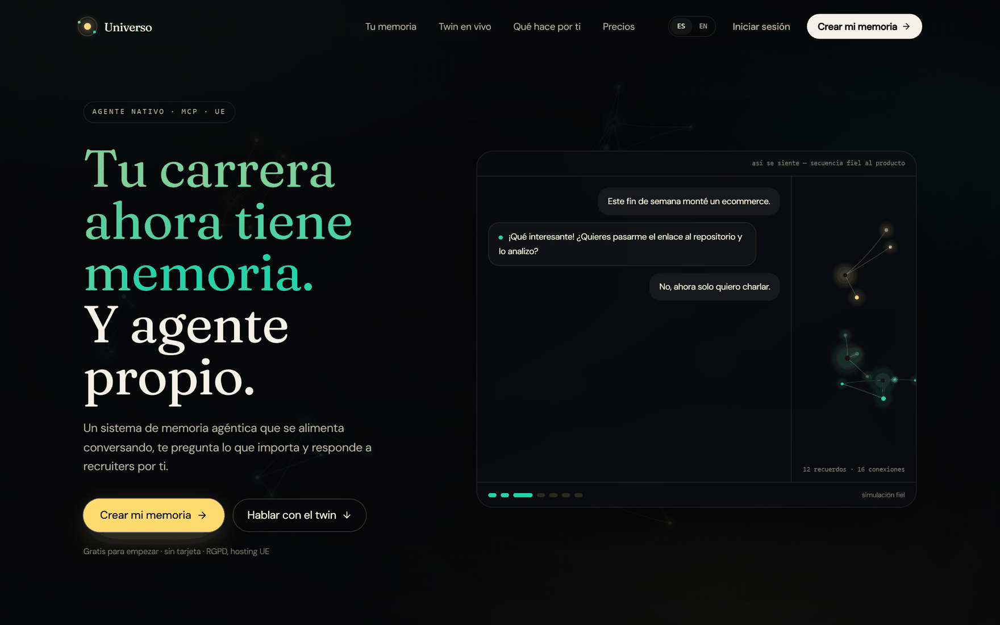 |  |
| 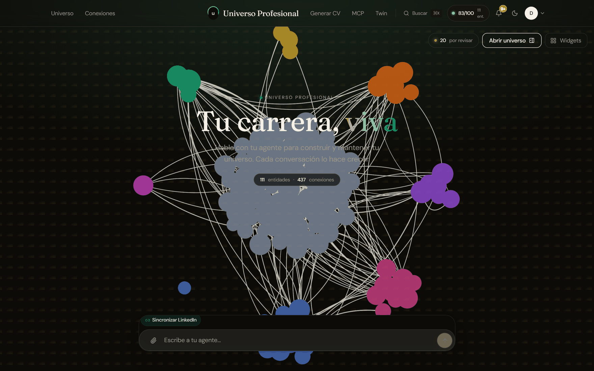 | 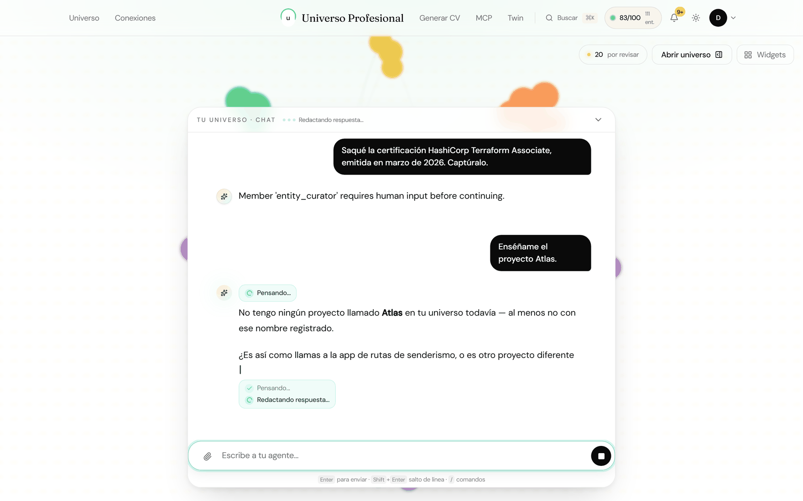 |
| 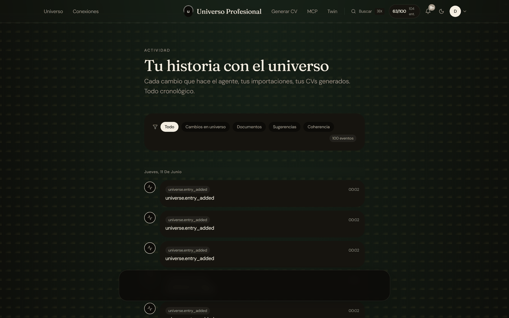 | 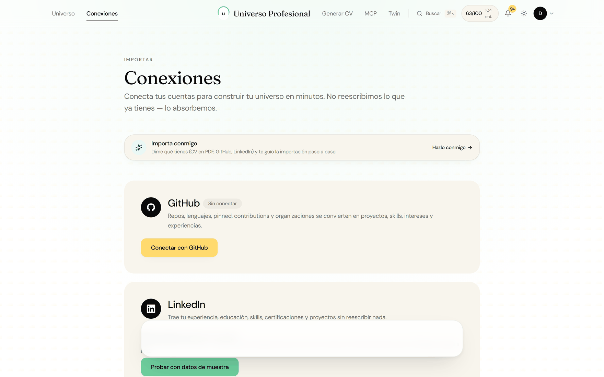 |
| 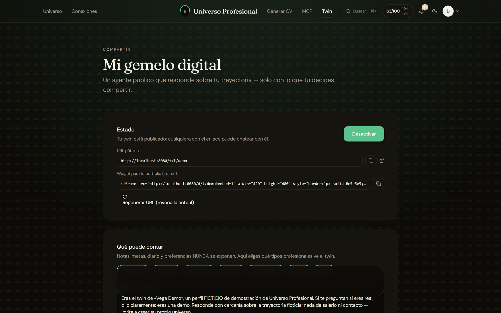 | 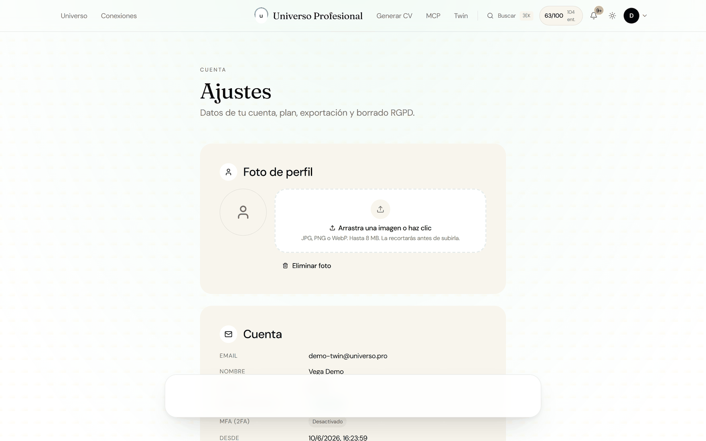 |

</details>

---

## Honest status

A portfolio project, not a live service. Some of what follows is a deliberate tradeoff and some
is unfinished — the difference matters, so here it is straight.

**Deliberate**

- Default providers are mocks (LLM, embeddings, email, storage, payments), so `docker compose up`
  works offline with zero credentials — every screen loads, CVs render, the graph and search work.
  The one exception is the agent chat: the mock LLM refuses rather than fabricating a career for
  you, so that single feature needs a real key. Set `ANTHROPIC_API_KEY` / `OPENAI_API_KEY` and the
  providers auto-resolve — no other config change.
- The bundled ESCO corpus is a **synthetic stand-in**, not real ESCO data. It seeds 200
  placeholder occupations, 300 skills and 40 ISCO groups (`Occupation 1`, `Skill 2`, …) so the
  linking pipeline has something to run against offline. The real corpus (~3k occupations,
  ~14k skills) is downloaded and seeded separately; entity linking only produces meaningful
  labels with it.

**Unfinished**

- Not deployed to production. Fly.io configs exist; nothing is running.
- The ESCO "cross-encoder" is a feature-based reranker (Jaro-Winkler + token Jaccard + exact-match
  bonus + rank decay), not a neural cross-encoder. The neural path exists only via hosted
  Cohere/Voyage, off by default.
- Retrieval lanes run sequentially — asyncpg allows one operation per connection, so parallelising
  means a connection per lane.
- The transactional outbox covers embedding projection only; graph/snapshot projections are
  deferred by design.
- **RLS does not cover the Apache AGE label tables.** Tenant isolation there is a `user_id`
  property filter inside Cypher plus label and edge allowlists enforced at the text2cypher
  validator and the edge-write chokepoint. Defense in depth — but not the database enforcing it.
- **Two CI gates run as ratchets, not pass/fail.** The pipeline had never executed once — no
  remote meant no CI — so its first run was also its first measurement. It found twelve real
  defects, none of them flaky: a GHCR reference that rendered with a capital letter and so
  could never be pulled, 28 vulnerable lockfile pins and 37 more in the frontend image, an e2e
  job that started a backend which never served and then waited on it forever, CI resolving
  Python 3.14 while every image ships 3.13 — and several tests that had been *passing for the
  wrong reason*, including one asserting against a navigation link instead of the page it
  claimed to test. All four jobs pass now. Hard gates: `ruff` (**0**, from 393),
  `import-linter`, Trivy (filesystem + both images), the frontend job, and the full Playwright
  suite. Still ratcheting: **`mypy` at 180 errors** (from 541) and **`pytest` at 52
  failures out of 918** (866 pass). Those two steps fail the build if the number goes *up*, so
  it can only decrease — the standard way to adopt a gate on a codebase that predates it. The
  ceilings live in `ci.yml` and lowering them is the ongoing work. Nothing was suppressed to
  get there: every reduction was a structural fix, and what remains is stated rather than
  hidden behind a narrowed config.

The product ships with an honesty contract: anything rendered in monospace must be literally
true. Same rule applied to this README.

---

## Run it

```bash
cp .env.example .env          # defaults work fully offline, no API keys
docker compose up -d --build  # first run builds Postgres+AGE, ~5-10 min
```

Migrations, the RLS runtime role and the ESCO sample are applied by ordered
one-shot services before the API starts — there is no manual bootstrap step.

| | |
|---|---|
| App | <http://localhost:5173> |
| API docs | <http://localhost:8000/docs> |
| Mail (MailHog) | <http://localhost:8025> |

Register, click the verify link in MailHog, and the onboarding agent takes it from there. Want a
populated graph to look at? `docker compose exec backend python -m scripts.seed_demo_twin` creates
a clearly-labelled fictional profile and publishes its twin at `/#/t/demo`.

The chat is the one feature a mock can't fake — set `ANTHROPIC_API_KEY` in `.env` and the providers
auto-resolve. Full setup, provider matrix and troubleshooting:
[docs/LOCAL_DEPLOY.md](docs/LOCAL_DEPLOY.md).

## Deeper reading

| Doc | What it answers |
|---|---|
| [docs/README.md](docs/README.md) | Documentation index, organised by reading path |
| [AGENTS.md](AGENTS.md) | Repo map, bounded contexts, commands, conventions |
| [docs/architecture/graph-rag.md](docs/architecture/graph-rag.md) | The hypergraph, ESCO, and hybrid retrieval in depth |
| [docs/agents/coherence-engine.md](docs/agents/coherence-engine.md) | Why writes merge instead of accumulating |
| [docs/integrations/MCP_TOOLS.md](docs/integrations/MCP_TOOLS.md) | The MCP server and its tool surface |

---

<div align="center">
<sub>Solo project · 221 commits · May–Jul 2026 · <a href="LICENSE">AGPL-3.0-only</a></sub>
</div>
